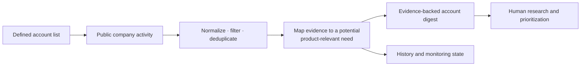

[← Portfolio](../README.md)

# Account signal monitoring lab

A personal experiment in using public company activity to identify changes that could create demand relevant to a product category.

**Status:** Exploratory lab. I tested the approach across roughly 100 public target accounts in a comparable territory. It was not an internal production system, and I am not claiming pipeline or revenue outcomes.

**My role:** I defined the hypothesis and evaluation criteria, reviewed the evidence, and tested and iterated on the output. I used Codex to help implement the Python workflow.

**Built with:** Python, SQLite, public job and news sources, and AI-assisted coding.

## The hypothesis

Most account monitoring tells you that something happened. The more useful question is:

> Does this public activity suggest a change that could create workload or demand relevant to our product category?

The experiment tested whether public signals could be collected, normalized, tied to a plausible product-relevant need, and presented with enough evidence for a person to decide whether an account warranted deeper research.

## How it worked

The system monitored public sources, retained the underlying evidence, and evaluated whether the activity indicated a change connected to the kinds of problems a product could address. It did not rank an account merely because the company was hiring.

For example, imagine an identity-security provider monitoring target accounts. Several postings that mention identity governance, access to a growing set of cloud applications, and consolidating access after acquisitions may indicate a broader access-management workload. That would not prove a buying project exists, but it could justify further account research.

## Design decisions

- **Separate observation from inference.** A posting or announcement is evidence; the possible product need is an interpretation.
- **Preserve the source.** Every surfaced signal should be reviewable rather than reduced to an unexplained score.
- **Prefer changes over static fit.** The system looked for activity that might explain why an account was worth examining now.
- **Keep a human in the loop.** The output supported research and prioritization; it did not trigger automatic outreach.
- **Retain history.** Monitoring state made it possible to distinguish new activity from information already reviewed.

## What the lab demonstrated

The lab produced an evidence-backed digest from a defined account list and created a repeatable way to test signal hypotheses. It demonstrated the architecture and review process, not commercial impact. A production version would still need source-reliability monitoring, calibrated scoring, governance, and validation against downstream sales outcomes.

The same pattern could be adapted to:

- Monitor changes across a client or customer portfolio.
- Identify employers showing evidence related to a job seeker's capabilities.
- Track competitor hiring, positioning, or expansion signals.
- Prioritize partners or accounts for deeper manual research.
