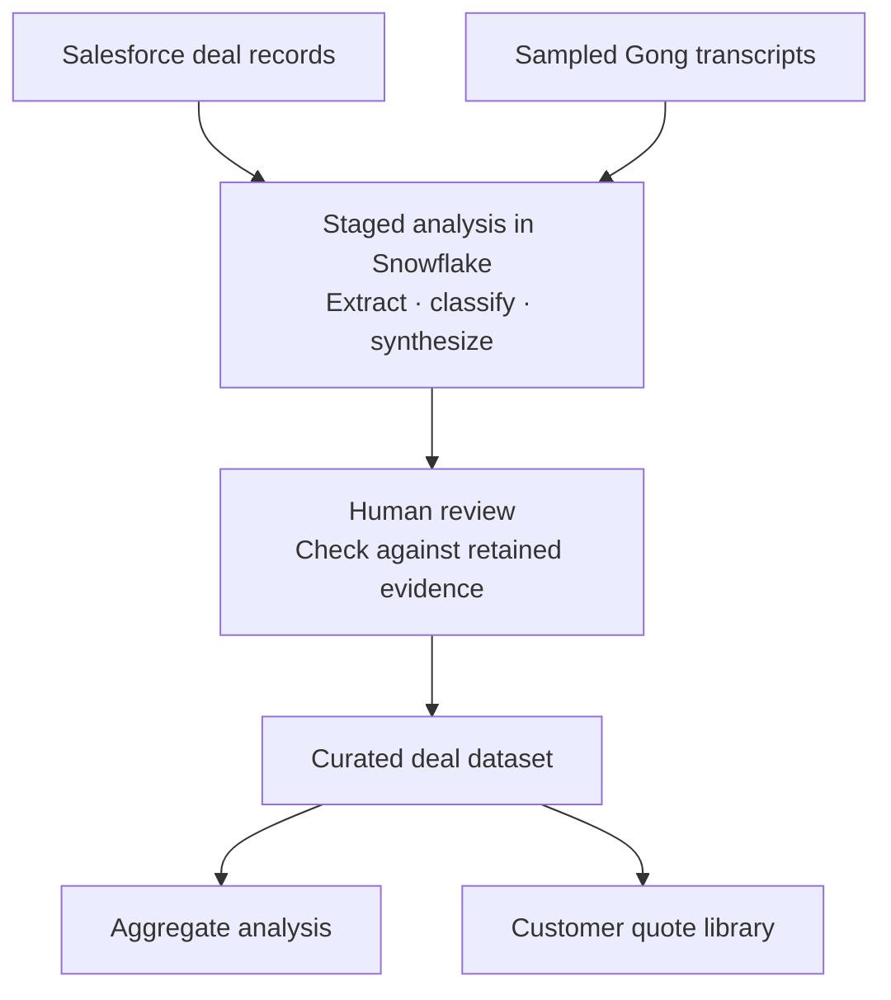

[← Portfolio](../README.md)

# Closed-won deal intelligence

A repeatable system that turns sales records and customer conversations into structured evidence about why customers bought—helping marketing ground messaging and campaigns in the problems behind revenue.

**My role:** Identified the need, designed the analytical framework, and built the downstream Snowflake views, joins, AI queries, validation checks, and review workflow. Created the decks and quote library and presented findings across marketing/sales.

**Built with:** Snowflake Cortex, SQL, Salesforce and Gong data, and GitHub.

## The problem

Marketing had strong attribution reporting. The team could track leads, qualified opportunities, and the channels credited with closed business. It was harder to quantify what those customers were struggling with, what prompted them to buy, and what they needed the product to solve.

That gap mattered during annual planning. I initially explored the question through Salesforce exports and selected Gong conversations. That produced useful directional themes. The next step was to analyze each deal consistently so those themes could be measured across the won-deal cohort.

## Making deals comparable

I built a staged pipeline around closed-won, new-logo deals. It combined Salesforce evidence with sampled Gong transcripts, extracting customer pains and organizing each deal into defined dimensions:

- The customer’s existing approach.
- The event creating urgency.
- The buying narrative and capabilities purchased.
- The champion and economic buyer.
- The competitors evaluated.

Some dimensions drew on our sales qualification methodology; others developed through reviewing the deals.

Each analytical question received selected fields and explicit classification rules. A vendor under evaluation, for example, did not necessarily represent the customer’s existing system. Separating those questions helped prevent misleading conclusions.

The resulting records supported aggregate analysis while retaining the evidence behind individual deals. Marketing could see how frequently a pattern occurred and explore the customer language behind it.

## Building confidence through evidence and judgment

Model responses and source text were retained in Snowflake. Automated checks tested whether extracted quotes appeared in their source, while additional checks surfaced missing information and conflicting classifications.

I reviewed quote candidates, speaker attribution, and ambiguous results before they entered the curated dataset. Edited quotes retained their original passages. Deals without suitable customer quotes could still contribute sales-record evidence without presenting it as the customer’s own words.

The workflow processes new deals incrementally and preserves previously reviewed outputs. Further automation is on the roadmap, but a quarterly exercise suits the pace at which these themes change.

Review also serves an analytical purpose: working through the evidence helps me internalize the deals, form my own interpretation, and explain the findings with confidence.

## How teams used it

The system gave marketing and sales a shared evidence base for messaging, campaign development, and planning. Its outputs were used in several ways:

- **Campaign creative:** Customer language from the curated quote library informed live advertising.
- **Sales enablement:** The analysis informed the configuration of an AI-assisted outbound tool implemented by another owner.
- **Program planning:** Teams incorporated the findings into planning materials to guide strategy.
- **Ongoing insight:** Content and product marketing stakeholders requested continued access to the analysis and recurring updates.

My contribution extended from building the system to interpreting and presenting its findings so teams could apply them. Its value is demonstrated through adoption across these workflows; a separate revenue contribution was not measured.

The analysis covers closed-won deals. It describes patterns within that cohort, rather than win rates or the wider market.
