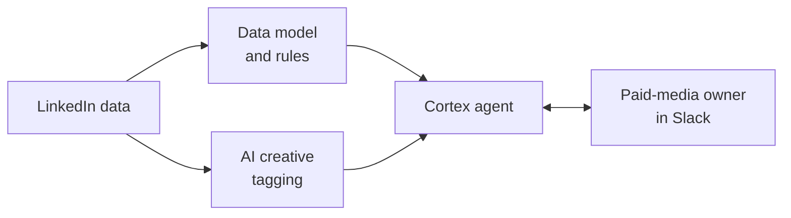
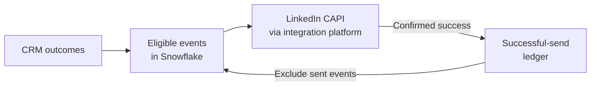

[← Portfolio](../README.md)

# LinkedIn paid-media intelligence

A system for comparing creative, investigating ad performance, and delivering downstream conversion signals to LinkedIn.

**My role:** Identified the problem through stakeholder interviews, designed the solution, and built the SQL models, creative tagging, conversational agent, and API integrations. Tested and refined the system with the paid-media owner.

**Built with:** Snowflake (Cortex), an integration platform, LinkedIn CAPI, and Slack.

**Partners:** Data engineering owned raw ingestion. The paid-media owner evaluated the outputs and made campaign and budget decisions.

**Impact:** Reduced manual reporting and informed meaningful improvements in lead volume, cost efficiency, creative decisions, and budget allocation. The performance gains reflect multiple changes across the program.

## The problem

The team managed hundreds of ads across regions, audiences, and formats. Two problems carried equal weight: analysis took too much manual work, and the paid-media owner lacked confidence in where to allocate budget.

Performance data and ad copy had to be brought together through exports and spreadsheets. Existing reporting lacked consistent creative dimensions—theme, value proposition, tone, and CTA—so comparing patterns across ads was difficult.

I identified the gap through team interviews, then validated the analysis with a one-month spreadsheet proof of concept reviewed with the paid-media owner.

## The system at a glance

### Understand what is working

The models, tagging, analytical views, and agent live in Snowflake. A semantic model and verified queries guide Cortex; an integration platform connects it to Slack. Two kinds of attributes make performance comparable across ads:

- **Rule-based attributes:** Derive targeting, region/country, segment, and ad type from naming conventions; classify copy length by word count and content type from the landing-page URL.
- **AI creative attributes:** Classify qualitative features such as theme, tone, value proposition, hook style, and CTA or headline style.

### Send downstream conversion signals

I prepared conversion events in Snowflake and built the integration-platform workflow to map and send them to LinkedIn, with retries, throttling, and a ledger of successful sends. The ledger records accepted delivery; LinkedIn separately determines campaign attribution.

## Decisions that mattered

- **Define a fair comparison.** Match metrics to campaign goals, preserve regional boundaries, and withhold trend labels when activity is insufficient.
- **Let the stakeholder guide the analysis.** Move from a constrained scheduled brief to conversational questions. Separate Slack acknowledgement from the longer analysis process.
- **Make delivery independently inspectable.** Build successful-send records while investigating attribution settings and stakeholder concerns about conversion totals.

## Evidence and outcomes

- **More leads at lower cost:** The program saw meaningful year-over-year improvement in lead volume and cost efficiency. These results reflect the system alongside targeting, campaign optimization, and other strategic changes; its individual contribution was not isolated.
- **Less manual reporting:** The system substantially reduced the paid-media owner's recurring reporting workload.
- **Better-informed budget allocation:** Better visibility into downstream conversions informed a shift in spend from lead-generation formats toward retargeting and conversion-focused campaigns. The paid-media owner made these decisions.
- **Action on creative fatigue:** Analysis helped the paid-media owner identify signs of fatigue in retargeting ads and reallocate spend, using metrics appropriate to the campaign's objective.

Results are based on reported program figures and stakeholder feedback. Improvement in fatigue-detection speed was not measured.

## Explore the reasoning

- [View the data architecture →](architecture.md)
- [Analysis, creative tagging, and the agent](analysis-and-agent.md)
- [Sending downstream conversion data to LinkedIn](conversion-signals.md)
