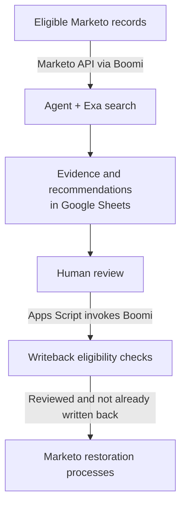

[← Portfolio](../README.md)

# Marketo Disqualified Agent (DQ)

An agent-assisted recovery workflow that returned **700 disqualified leads to marketable status**.

I identified the opportunity, scoped the solution, and built the agent, API integrations, review interface, and Marketo restoration logic. I demonstrated it in the Marketo sandbox, secured the marketing operations leader’s sign-off, and continue to operate and refine it.

**Built with:** Marketo, Boomi, Exa, Google Sheets, and Apps Script.

**Development and iteration:** Claude with Boomi Companion.

## The opportunity

People sometimes enter abbreviated names, incomplete company details, or placeholder titles on forms while providing a plausible business email. Marketo’s existing rules could disqualify these submissions as a “fake person” or “fake company,” excluding legitimate prospects from marketing.

Field-matching rules were difficult to tune around all the combinations of name, email, company, and title. Recovery needed context: evidence that the submission belonged to a real person currently working at the business associated with the address.

I scoped the agent to those two disqualification reasons, excluded other disqualifying conditions, and added filters such as screening out personal email domains.

## The system

The agent checks the submitted identity against web evidence, including company and current-employment information. It assesses whether the business email is plausible for that person.

Google Sheets presents the original fields alongside the agent’s decision, confidence, reasoning, and findings. I review the recommendations there and trigger writeback from the sheet. Boomi skips records without human approval and those already marked as written back, so the sheet can hold successive batches.

Decisions and proposed corrected details are stored in a dedicated Marketo field. Static-list membership triggers the downstream processes that remove disqualification and restore the appropriate status. Other marketability criteria still apply.

## Operating and improving the agent

Early manual review uncovered a reasoning error: the agent sometimes kept marketing and sales contacts disqualified because they were outside the ideal customer profile. Those people could still be legitimate, marketable contacts. The agent needed to distinguish identity validity from targeting fit.

I used Claude with Boomi Companion’s headless API access to translate my feedback into agent-rule updates in Boomi. I checked decisions in subsequent batches and sometimes reran individual leads to assess the change. Reviewing live results and refining the rules remains part of each operating cycle; uncertain cases and failed calls surface for review.

Eligibility needed iteration too. About 900 people were removed from disqualified status, but roughly 200 remained unmarketable for other reasons. That finding led me to tighten the initial selection criteria.
