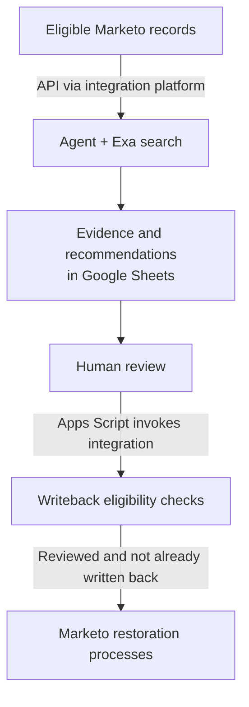

[← Portfolio](../README.md)

# Lead eligibility recovery workflow

An agent-assisted recovery workflow that returned **hundreds of legitimately eligible records to marketable status**.

I identified the opportunity, scoped the solution, and built the agent, API integrations, review interface, and Marketo restoration logic. I validated it in a non-production environment and continue to operate and refine it with stakeholder review.

**Built with:** Marketo, an integration platform, Exa, Google Sheets, and Apps Script.

**Development and iteration:** AI-assisted coding.

## The opportunity

People sometimes enter abbreviated names, incomplete company details, or placeholder titles on forms while providing a plausible business email. Existing data-quality rules could flag these submissions and exclude legitimate prospects from marketing.

Field-matching rules were difficult to tune around all the combinations of name, email, company, and title. Recovery needed context: evidence that the submission belonged to a real person currently working at the business associated with the address.

I scoped the agent to a narrow set of identity- and company-related data-quality flags, excluded unrelated conditions, and added eligibility filters before research began.

## The system

The agent checks the submitted identity against web evidence, including company and current-employment information. It assesses whether the business email is plausible for that person.

Google Sheets presents the original fields alongside the agent’s decision, confidence, reasoning, and findings. I review the recommendations there and trigger controlled writeback from the sheet. The integration skips records without human approval and those already processed, so the sheet can hold successive batches.

Reviewed decisions and proposed corrections are written back through controlled fields and existing restoration workflows. Other marketability criteria still apply.

## Operating and improving the agent

Early manual review uncovered a reasoning error: the agent sometimes conflated identity validity with targeting fit. A legitimate, marketable contact does not necessarily match every targeting preference, so the agent needed to evaluate those questions separately.

I used AI-assisted coding to translate feedback into agent-rule updates in the integration platform. I checked decisions in subsequent batches and sometimes reran individual records to assess the change. Reviewing live results and refining the rules remains part of each operating cycle; uncertain cases and failed calls surface for review.

Eligibility needed iteration too. A meaningful share of researched records remained unmarketable for unrelated reasons. That finding led me to tighten the initial selection criteria.
