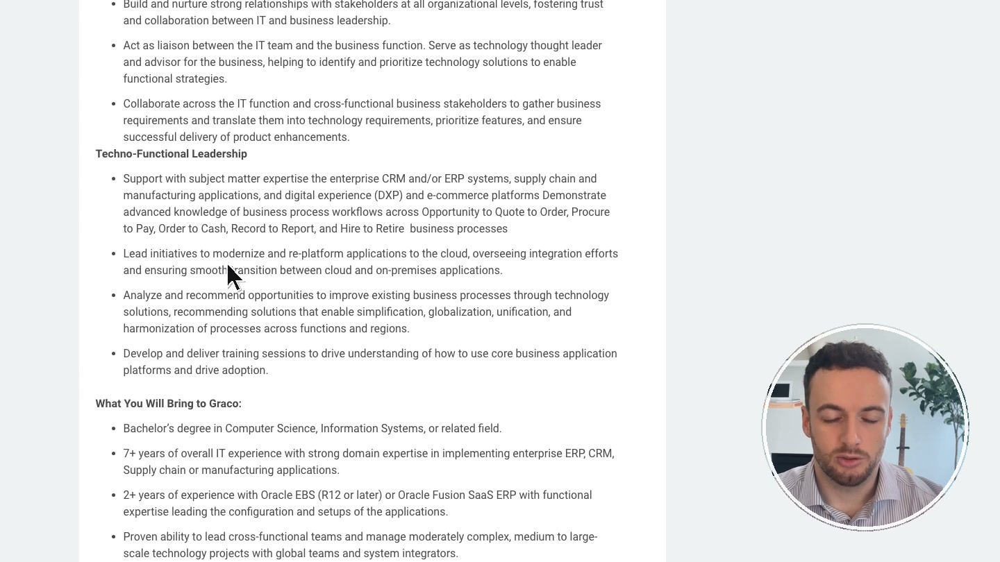

[← Portfolio](../README.md)

# Account research to personalized video at scale

An exploratory build testing whether account research and recent voice-and-avatar tools could make on-camera outreach more scalable without losing the evidence behind the message.

**Status:** Completed demo, not a scaled outbound program. I did not send the example or measure response, pipeline, or revenue outcomes.

**Concept inspiration:** Lorcan O'Rourke's [Claude Code + HeyGen + Clay Killed the Generic Sales Demo](https://www.youtube.com/watch?v=xIdsgP2NYlQ). I recreated the concept in my own environment and adapted the research, evidence synthesis, and final presentation.

**My role:** I implemented and tested the workflow, expanded the research step, reviewed the evidence, shaped the script, generated the voice and avatar assets, and used Python and ffmpeg to compose the final video.

**Built with:** Clay, Codex, ElevenLabs, HeyGen, Python, Chrome DevTools, and ffmpeg.

[Open the complete showcase and watch the 54-second demo →](https://gregtrav.github.io/gtm-systems-portfolio/)

## The experiment

Video can help a seller stand out and communicate with more presence than another email, but recording a researched video manually for every account does not scale. The experiment asked whether a system could create many distinct videos of the seller speaking on camera—each one connecting a target company's situation to a relevant product capability and customer story.

The goal was not generic personalization. It was to test whether the latest voice-cloning and avatar tools could turn account research into a credible, evidence-backed video while keeping production effort manageable.

## From research to message

Clay supported account and contact selection. The research step then gathered public company and professional context rather than relying on one fixed field. In the completed example, professional context and a separate hiring signal aligned around the same business change. That evidence was matched to a relevant customer story and synthesized into the script.

The finished 54-second video combined:

- A cloned version of my voice.
- An AI avatar of me delivering the message.
- On-screen evidence supporting the account connection.
- Python and ffmpeg composition to assemble the final artifact.

## How I adapted the concept

The reference workflow already combined account research, contact selection, a relevant use case, and customer proof. My version broadened the research inputs and made the evidence bridge explicit: show why the account context and customer example belong together, then keep that support visible while the video plays.

## Design decisions

- **Research before generation.** Confirm the evidence and script before using voice or avatar credits.
- **Distinguish evidence from interpretation.** Public facts support the message; the proposed relevance remains a hypothesis.
- **Keep the proof visible.** The video presentation shows supporting evidence rather than asking the viewer to trust an unexplained claim.
- **Review before outreach.** A person should approve the research, match, and wording before anything is sent.
- **Make the workflow recoverable.** Cached media and a portable HTML package make the output easier to inspect, revise, and reuse.

## Where it could fit

This approach may be most useful for a solo seller, founder-led motion, or smaller team that wants more video presence than its headcount normally allows. It could also support a selective account-based campaign where the value of a researched message justifies the additional generation and review steps.

The lab demonstrates a completed workflow and artifact. It does not establish that AI-generated video improves response or conversion rates; that would require a controlled outreach test.
